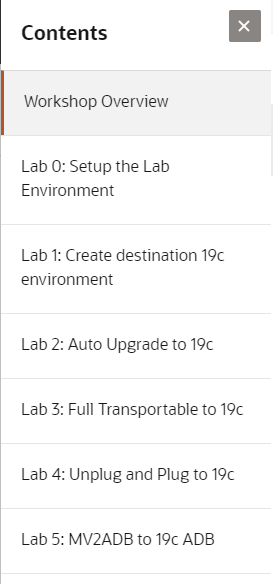

# Upgrade to 19c Hands-On-Lab (HOL) #

## Workshop Overview ##

**19c Database** is the current version that Oracle promotes to customers and partners as the version to upgrade to. Oracle 19c is the long term support version and will be supported for at least 4 years after the initial release. After this, Extended support and Sustaining support will be available.

This hands-on workshop focuses on **Upgrading your environment to 19c** demonstrating 4 scenarios that you can use (both on-premise and in the cloud) to upgrade your environment to 19c in a Container/Multitenant setup.

## Workshop Requirements

* Access to Oracle Cloud Infrastructure
    * Provided by the instructor for instructor-led workshops
* Access to a laptop or a desktop
    * Requires Microsoft Remote Desktop software
* Knowledge of Python is a plus but not required
* No previous knowledge of machine learning required

## Agenda

- **Lab 0 :** Setup the Lab Environment

This lab introduces the student lab environment and contains the steps to setup the student desktop for connecting to the lab virtual machine.

- **Lab 1 :** Upgrade using the new AutoUpgrade tool

The new Auto Upgrade tool is a wrapper around the regular upgrade steps and scripts. But the configuration fail is easy to setup and allows multiple databases to be upgraded at the same time while still keeping track of the status. If things go wrong, you can rollback the upgrade or restart the upgrade after you have solved the blocking issue.

- **Lab 2 :** Upgrade using Full Transportable Tablespaces

Instead of upgrading your database using scripts, you can simply migrate the tablespaces containing your data to a new version. The FTTS demonstrates Learn to perform exploratory data analysis of database-resident data and apply best practice techniques to prepare the data for machine learning. This hands-on lab highlights the OML4py Transparency Layer, and demonstrates that many familiar Python functions automatically translate to SQL and run inside the database for optimal performance and execution.

- **Lab 3 :** Upgrade using unplugging a PDB from the old version and plug it into a new version

One of the nice new features of Multitenancy is to simply unplug and plug a Pluggable Database into a new version. In 19c, you still need to run upgrade scripts so this lab demonstrates what is needed to upgrade using this option.

- **Lab 4 :** Upgrade to 19c on Oracle Autonomous Database cloud using MV2ADB

Upgrade and migrate to Autonomous Database Cloud requires some separate steps. The tool MV2ADB helps you with this, gathers the information in a configuration file and execute all steps for you. This lab shows you the steps in an example migration.

## Access the labs

- Use **Lab Contents** menu on your right to access the labs.
    - If the menu is not displayed, click the menu button  on the top right  make it visible.

- From the menu, click on the lab that you like to proceed with. For example, if you like to proceed to **Lab 0**, click **Lab 0: Setup the Lab Environment**.

- You may close the menu by clicking 
