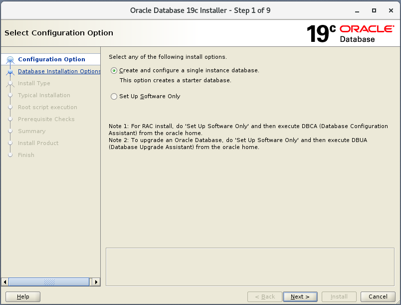
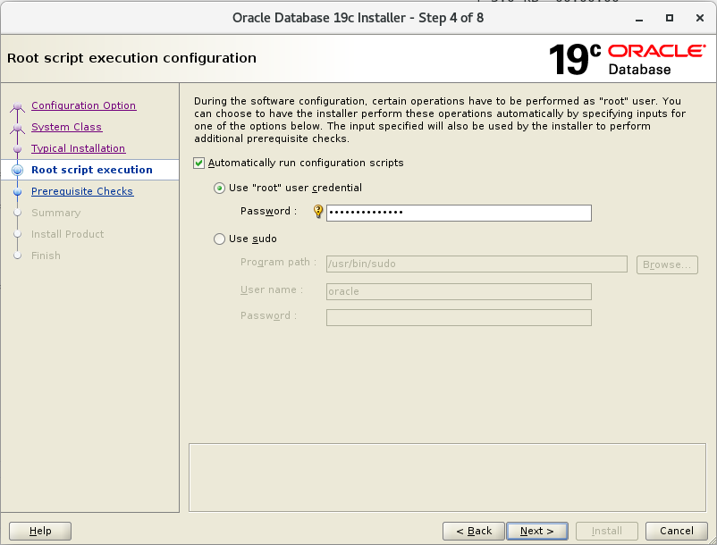
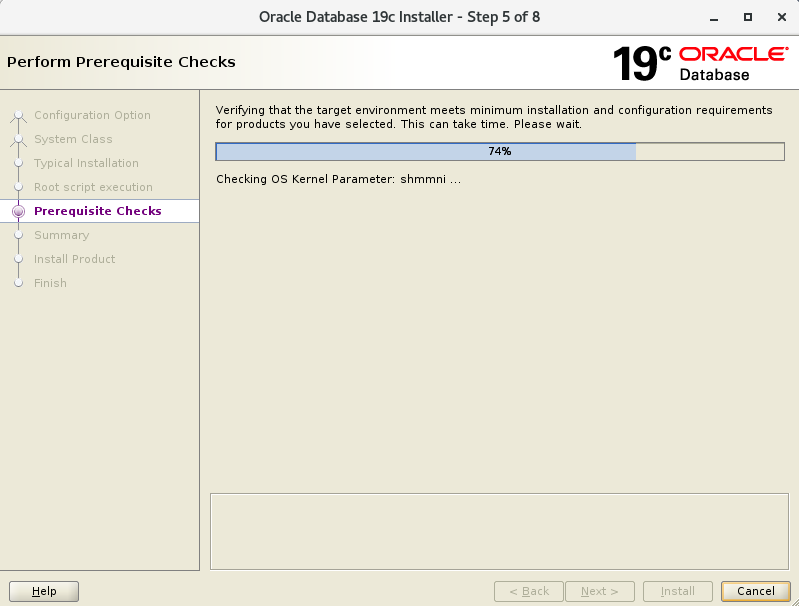

# Install new 19c database #

In this lab we will install the 19c database software and create a new 19c database (and listener) as target for the other upgrades.

## Disclaimer ##
The following is intended to outline our general product direction. It is intended for information purposes only, and may not be incorporated into any contract. It is not a commitment to deliver any material, code, or functionality, and should not be relied upon in making purchasing decisions. The development, release, and timing of any features or functionality described for Oracle’s products remains at the sole discretion of Oracle.

## Prerequisites ##

- You have access to the Upgrade to a 19c Hands-on-Lab client image

## Prepare 19c software and operating system ##

Before we can upgrade to Oracle 19c, we need to have the Oracle software installed. Outside of this training environment, you should download production software base release from [https://eDelivery.oracle.com](https://eDelivery.oracle.com "eDelivery.oracle.com"). In a production environment, please also download the patches required and apply them before you create or upgrade any instances. Patches to upgrade the base 19c version (19.3.0) can be downloaded from [https://support.oracle.com](https://support.oracle.com).

In this workshop, we have already downloaded the software for you. You need to adhere to the Oracle license restrictions when using this software. For training purposes when using this Hands-On Lab, the Oracle Technology Network license will apply. All software required is available in the `/source` directory in your image.

### Locate 19c software and unzip in correct location ###

The software downloaded from the Oracle network is a zipfile for your operating system/architecture. In 19c, the location where you unzip the software and start the Oracle Universal Installer (OUI) **will be used as your new Oracle Home** so be careful where you unzip the software. The running of the OUI will only register the software with the inventory (or will create an inventory if none exist). 

First we need to create a new location for the software. Execute the following command as oracle user after starting a new terminal window in your image:

````
$ <copy>mkdir -p /u01/app/oracle/product/19.0.0/dbhome_193</copy>
````

We can now use this new location to unzip our software

````
$ <copy>cd /u01/app/oracle/product/19.0.0/dbhome_193</copy>
````
````
$ <copy>unzip /source/db_home_193_V982063.zip</copy>

...
  javavm/admin/classes.bin -> ../../javavm/jdk/jdk8/admin/classes.bin
  javavm/admin/libjtcjt.so -> ../../javavm/jdk/jdk8/admin/libjtcjt.so
  jdk/jre/bin/ControlPanel -> jcontrol
  javavm/admin/lfclasses.bin -> ../../javavm/jdk/jdk8/admin/lfclasses.bin
  javavm/lib/security/cacerts -> ../../../javavm/jdk/jdk8/lib/security/cacerts
  javavm/lib/sunjce_provider.jar -> ../../javavm/jdk/jdk8/lib/sunjce_provider.jar
  javavm/lib/security/README.txt -> ../../../javavm/jdk/jdk8/lib/security/README.txt
  javavm/lib/security/java.security -> ../../../javavm/jdk/jdk8/lib/security/java.security
  jdk/jre/lib/amd64/server/libjsig.so -> ../libjsig.so
````

We will not install any patches during this workshop so we can continue to prepare the operating system environment.

### Install the 19c pre-install RPM on the system ###

An easy way to make sure all system parameters are correct in a Linux environment is to use the preinstall rpm package. For non-Linux environments, please check the manual for the appropriate environment values. We have already downloaded the preinstall rpm in the environment so you can simply install it.

````
$ <copy>sudo yum -y localinstall /source/oracle-database-preinstall-19c-1.0-1.el7.x86_64.rpm</copy>

Loaded plugins: langpacks, ulninfo
Examining /source/oracle-database-preinstall-19c-1.0-1.el7.x86_64.rpm: oracle-database-preinstall-19c-1.0-1.el7.x86_64
Marking /source/oracle-database-preinstall-19c-1.0-1.el7.x86_64.rpm to be installed
Resolving Dependencies
...
Running transaction
  Installing : oracle-database-preinstall-19c-1.0-1.el7.x86_64          1/1 
  Verifying  : oracle-database-preinstall-19c-1.0-1.el7.x86_64          1/1 

Installed:
  oracle-database-preinstall-19c.x86_64 0:1.0-1.el7                                                                    

Complete!
````

## Run OUI and create new 19c database ##

Before you can use the unzipped Oracle software, we need to run the Oracle Universal Installer (OUI) to register the software to the Oracle Inventory on the system and do mandatory (relinking) steps for this OS. This can either be done in a GUI mode or in a character mode (for systems that do not have access to a graphical interface). In this lab, we will run the OUI in GUI mode for learning purposes.

### Run OUI ###

While running the OUI, we can choose to install the software only or to install the software and create a database. For various reasons, we will both install the software and create a new database in this lab. Execute the following commands in your terminal window as oracle user:

````
$ <copy>cd /u01/app/oracle/product/19.0.0/dbhome_193</copy>
````
````
$ <copy>./runInstaller</copy>
````

The following screen should be visible on your (remote) desktop:


 
- Keep the default 'Create and Configure a single instance database' and press `NEXT`
- Choose 'Desktop class' and press `NEXT`

The desktop class will display 1 screen with all of the information required to create this type of database. If you think you need (for your local environment) other settings than displayed on the Desktop class screen, feel free to use the Server class. If you choose for the Server class, please check the documentation for the values to be used. For the Oracle provided Workshop environment, the Desktop class is enough. 

Make sure to check and change the following values in the various fields:

- Oracle Base
	- /u01/app/oracle (no changes)
- Database File Location
	- /u01/oradata **(change this value)**
- Database Edition
	- Enterprise Edition (no changes)
- Characterset
	- Unicode (no changes)
- OSBDA group
	- oinstall (no changes)
- Global Database name
	- CDB19 **(change this value)**
- Password
	- Welcome_123 **(change this value)**
- Create as Container database
	- Checked (no changes)
- Pluggable database name
	- PDB19C01 **(change this value)**


- After you have entered the correct values, please press the `NEXT` button to continue.

The following screen should be visible:



Like previous installations, the `root.sh` script needs to be executed after the relinking and registration of the Oracle Home. This screen lets you decide whether or not you want the OUI to do this for you. In this workshop environment, you can use the root password (`OraclePTS#2019`) for automatic execution of the root.sh script(s). For your local environment (at home), do what is applicable for your situation.

- Check the option to automatically execute the configuration scripts and enter the root password `OraclePTS#2019`
 
The system will now start checking the prerequisites for the 19c installation.



If all prerequisites have been checked and no warnings or errors can be found, the summary screen will be displayed:


- Press the `Install` button to start the installation and database creation.


After a while, provided there are no issues during the install, the root.sh script needs to be executed. If you have entered the password for the root user in the OUI, permission will be asked to execute the scripts:


- Click the `Yes` button to continue

> If you did not provide a root password or sudo information, a different window will be displayed. 
> 
> 
>
> If you do not get the option to click `Yes`, please execute the script mentioned in the window as root user in a terminal environment.
 
The installer will now start to create the new CDB database with its PDB. This can take between 20 and 40 minutes.

If this is a instructor-led class (either on-site or through a Live-Virtual-Class system) ** Please inform your instructor that you are waiting for the database install to finish ** so he/she can keep track of the progress of the installs and perhaps continue with presentations if everybody is waiting.

After the database creation has finished, the following screen (or similar) will be displayed:


 
- Press the `Close` button to end the Universal Installer session.

Your 19c Oracle Home has been created and the initial database (CDB19) has been started.

## Change default memory parameters ##

The OUI takes a certain percentage of the available memory in our environment as default SGA size. In our workshop environment, this is an SGA of 18G. We need the memory for other tasks (databases) later on so we will need to lower the memory usage of the new instance:

Please execute the following commands as Oracle user:

````
$ <copy>. oraenv</copy>
````
````
ORACLE_SID = [oracle] ? <copy>CDB19</copy>
The Oracle base remains unchanged with value /u01/app/oracle\
````
````
$ <copy>sqlplus / as sysdba</copy>
````
````
SQL> <copy>alter system set sga_max_size=4G scope=spfile;</copy>

System altered.
````
````
SQL> <copy>alter system set sga_target=4G scope=spfile;</copy>

System altered.
````
````
SQL> <copy>shutdown immediate</copy>
Database closed.
Database dismounted.
ORACLE instance shut down.
````
````
SQL> <copy>startup</copy>
ORACLE instance started.

Total System Global Area 4294964632 bytes
Fixed Size                  9143704 bytes
Variable Size             855638016 bytes
Database Buffers         3422552064 bytes
Redo Buffers                7630848 bytes
Database mounted.
Database opened.
````
````
SQL> <copy>alter pluggable database all open;</copy>

Pluggable database altered.
````

Your database is now ready for the Hands-On labs.

## Acknowledgements ##

- **Author** - Robert Pastijn, Database Product Management, PTS EMEA - March 2020

